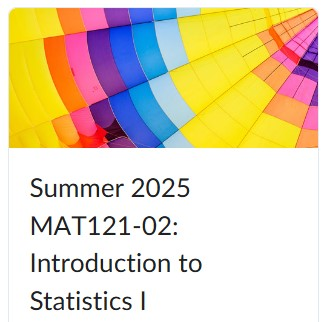
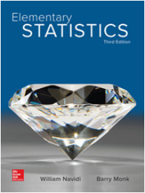

```{=html}

<style type="text/css">

div#TOC li {
    list-style:none;
    background-image:none;
    background-repeat:none;
    background-position:0;
}

/* Cascading Style Sheets (CSS) is a stylesheet language used to describe the presentation of a document written in HTML or XML. it is a simple mechanism for adding style (e.g., fonts, colors, spacing) to Web documents. */

h1.title {  /* Title - font specifications of the report title */
  font-size: 22px;
  font-weight: bold;
  color: navy;
  text-align: center;
  font-family: "Gill Sans", sans-serif;
}
h4.author { /* Header 4 - font specifications for authors  */
  font-size: 18px;
  font-weight: bold;
  font-family: system-ui;
  color: navy;
  text-align: center;
}
h4.date { /* Header 4 - font specifications for the date  */
  font-size: 18px;
  font-family: system-ui;
  color: DarkBlue;
  text-align: center;
  font-weight: bold;
}
h1 { /* Header 1 - font specifications for level 1 section title  */
    font-size: 18px;
    font-family: "Gill Sans", sans-serif;
    color: navy;
    text-align: center;
    font-weight: bold;
}
h2 { /* Header 2 - font specifications for level 2 section title */
    font-size: 16px;
    font-family: "Gill Sans", sans-serif;
    color: navy;
    text-align: left;
    font-weight: bold;
}

h3 { /* Header 3 - font specifications of level 3 section title  */
    font-size: 14px;
    font-family: "Gill Sans", sans-serif;
    color: navy;
    text-align: left;
}

h4 { /* Header 4 - font specifications of level 4 section title  */
    font-size: 12px;
    font-family: "Gill Sans", sans-serif;
    color: darkred;
    text-align: left;
}

body { background-color:white; }

.highlightme { background-color:yellow; }

p { background-color:white; }

</style>
```

```{r setup, include=FALSE}
# code chunk specifies whether the R code, warnings, and output 
# will be included in the output files.
if(!require('vembedr')) {
  install.packages('vembedr')
  library('vembedr')
}
if (!require("knitr")) {
   install.packages("knitr")
   library(knitr)
}
# knitr::opts_knit$set(root.dir = "C:/Users/75CPENG/OneDrive - West Chester University of PA/Documents")
# knitr::opts_knit$set(root.dir = "C:\\STA490\\w05")

knitr::opts_chunk$set(echo = FALSE,       
                      warning = FALSE,   
                      result = TRUE,   
                      message = FALSE)
```


\

# Introduction 

<font color = "darkred">**This is a 100% online, asynchronous course.**</font>

The materials will be delivered in a distance learning format (online) through the course website (https://pengdsci.github.io/MAT121W5/). You are expected to check this page frequently during this 5-week summer semester for updates and new course materials.

**D2L is used only for weekly exams and the final exam. All weekly topic lists, lecture notes, online practice exercises, and interactive statistics learning apps are available exclusively on the course website, not on D2L.**

The course materials are structured in a modular format, with each module focusing on a specific topic or theme. Each module includes a dedicated web page containing a topic list, links to lecture notes (which feature embedded short videos), online practice exercises, and ISLA apps for self-assessment to gauge your understanding. At the end of each week, you will take a weekly exam through D2L covering all topics from that week's three modules.


# What Are You Expected to Do Every Week?

You will complete three modules each week, which are structured in the right navigation panel on the course webpage (https://pengdsci.github.io/MAT121/). For each module, follow the suggested workflow below:

* **Review the module-specific page** to see the list of topics and learning resources.

* **Study the module notes**:

For each module note, you are expected to

  + study the content to understand the concepts and procedures. 
  + watch the embedded short videos in the note to reinforce your understanding.
  + work through the examples (<font color = "red">i.e., not simply read the worked out examples </font>) and check the provided answers. 
  + attempt any trial exercises in the lecture notes (if available) and use the appropriate **ISLA apps** to verify your work.
  + practice additional online exercises linked on the module’s webpage.

* **After completing all three modules**, go to **D2L** to take the **weekly exam**, which covers topics from all three modules. There are **four weekly exams** and a **final exam**. Each exam has a standalone webpage with detailed instructions.


* After finish all three modules, go to D2L to complete the weekly exam the covers all topics from the three modules. There are four weekly exams and a final exam. Each exam has standalone web page detailed information about the exams. 

* **To find the weekly exam on D2L**,
  + Log in to D2L using your WCU login credentials.
  + Click the course icon (shown below) to access the course page.
```{r echo =FALSE, fig.align='center', out.width="30%"}

```
  + From the **Assessments** drop-down menu, select **Quizzes**.
  + Click the link for the appropriate weekly quiz.


# Some Advice

This is a short and intensive summer course. To enhance your online learning experience and achieve your goals, I offer the following advice:

* Start early on weekly materials - **never wait until the last minute**. Procrastination will ruin your progress.

* Practice (**Don’t Just Read**) Examples and Online Multiple-Choice Problems:

  **Tip**: Treat multiple-choice problems as "show-your-work" problems. Solve them step by step, then select the correct answer based on your reasoning. For the **online practice exercises**, only click the "answer" button after completing your work. Use these online resources wisely and responsibly.

* **Using an Appropriate ISLA (Interactive Statistical Learning App)**:
   
   Use **ISLA** to verify your work and ensure accurate statistical reasoning. If your answers differ from the app’s, carefully review your work to identify mistakes. This method helps debug your thinking and strengthens your understanding.

* **Seeking Help When Needed**:

   If you struggle with certain concepts or examples, note them down and reach out to me or the excellent tutors at MLC. Remember: You can succeed regardless of your prior math experience. Challenges are part of learning - don’t hesitate to ask for help from me, tutors, or peers. Never give up!


# Some Additional Information on Exams


**No Make-up Weekly Exams** – You have **two and a half days** to complete the exams. I will post the solutions on the corresponding exam-specific web pages. 

* **Additional Information About Weekly Midterm Exams**:
  + Each **weekly exam** contains only **33–35 multiple-choice questions**. There are **no show-your-work** problems.
  + Every student will receive a different version of the weekly exam, **all with the same level of difficulty**.
  + You are allowed **three attempts per weekly exam**, and your **highest score** will be recorded.
  + If you **reattempt** the exam, you must restart the entire exam <font color="red">(**not just the questions answered incorrectly on previous attempts**)</font>.
  + The **answer key** for the master problem set, which the quiz is based on, will be posted on the course webpage every Monday. You can use it to practice and prepare for your **final cumulative exam**.
  + If your answers differ from the suggested answer key and you cannot identify the issue, please reach out for help as soon as possible. <font color="red">**However, if your answer is very close to one of the given choices, please select the closest option, as any slight difference may be due to rounding errors.**</font>
  + Your weekly exams are **timed** (see the exam-specific web pages for more details) although you can choose a convenient time to start with. You may use **any available resources** while working on the assignments.


* **Additional Information about the Final Exam**
  + The final exam is cumulative, covering all topics discussed during the 5-week semester.
  + Unlike the weekly midterm exams, where you could choose your start time, the **final exam is scheduled for June 27 from 3:30 PM to 5:30 PM. This is the only available slot - all students must take the exam at the same time.**

\

# Policies, Resources, and Expectations

**Course policies and expectations for exams** are outlined in the syllabus which is posted on the course web page (link is on the top navigation panel).

I provide **comprehensive lecture notes** and have developed **17 interactive statistics learning apps** specifically for this course. Therefore, you do not need to purchase any additional materials or devices. All you need is a commitment to studying the weekly materials and practicing problems through the online exercises.


## Textbook <font color = "red">(Not Required)</font>

**Elementary	Statistics**, by Navidi and Monk, 3rd edition.

```{r fig.align='center', out.width = '30%'}

```

You should opt out of the required eBook and once you receive an email. Otherwise, you will be charged for the electronic textbook.


## Interactive Statistics Learning Apps (ISLA)

I have invested considerable effort into creating a variety of graphics in the notes and eBook to help you visualize the material whenever possible. Additionally, I’ve developed interactive apps, **ISLA** that complement the topics covered in the lecture notes. These apps are organized as standalone sections under the **Use of Technology** heading to further enhance your understanding of the content.


## Calculators and Technologies

**Graphing calculators are not required for this class**, as we only use them occasionally for simple calculations. Instead, you should have a **basic scientific calculator** capable of performing the four basic operations (`+`, `-`, `×`, `÷`)and square roots ( $\sqrt{x}$.

You can also use the **ISLA** apps as a statistical calculator, both to verify your manual calculations and to check results in the lecture examples (which is how I use it in class).


\

# Components of Course Grade

As outlined in the syllabus, your final course grade will be determined by four weekly midterm exams and the final exam, each worth 20%.

**There will be no make-up exams.** If you miss a midterm for a legitimate reason, I will use your raw score on the final exam to replace **one and only one** of the missed midterm grade.

The answer key for each midterm will be posted on the course webpage shortly after the exam due date.

If necessary, I may curve the midterm and final exam scores based on the class's overall performance.

\


