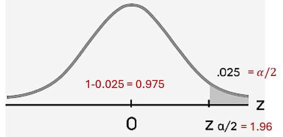
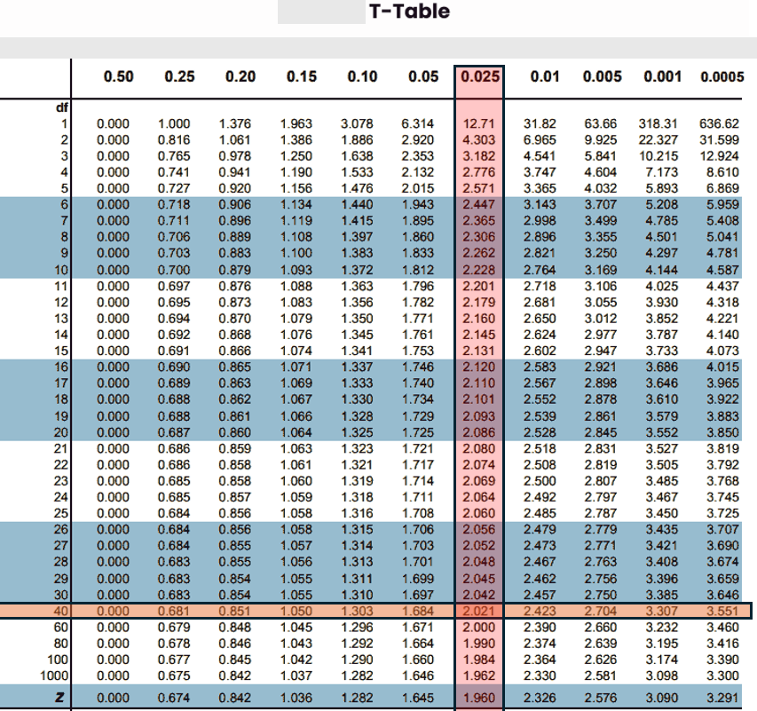

```{css, echo = FALSE}

div#TOC li {
    list-style:none;
    background-image:none;
    background-repeat:none;
    background-position:0;
}
h1.title {
  font-size: 24px;
  color: DarkRed;
  text-align: center;
}
h4.author { /* Header 4 - and the author and data headers use this too  */
    font-size: 18px;
  font-family: "Times New Roman", Times, serif;
  color: DarkRed;
  text-align: center;
}
h4.date { /* Header 4 - and the author and data headers use this too  */
  font-size: 18px;
  font-family: "Times New Roman", Times, serif;
  color: DarkBlue;
  text-align: center;
}

h1 { /* Header 3 - and the author and data headers use this too  */
    font-size: 20px;
    font-family: "Times New Roman", Times, serif;
    color: darkred;
    text-align: center;
}
h2 { /* Header 3 - and the author and data headers use this too  */
    font-size: 18px;
    font-family: "Times New Roman", Times, serif;
    color: navy;
    text-align: left;
}

h3 { /* Header 3 - and the author and data headers use this too  */
    font-size: 16px;
    font-family: "Times New Roman", Times, serif;
    color: navy;
    text-align: left;
}

```


```{r setup, include=FALSE}
# code chunk specifies whether the R code, warnings, and output 
# will be included in the output files.
if (!require("knitr")) {
   install.packages("knitr")
   library(knitr)
}
# knitr::opts_knit$set(root.dir = "C:/Users/75CPENG/OneDrive - West Chester University of PA/Documents")
# knitr::opts_knit$set(root.dir = "C:\\STA490\\w05")

knitr::opts_chunk$set(echo = FALSE,       
                      warning = FALSE,   
                      result = TRUE,   
                      message = FALSE)
```


\


# Introduction

This note focuses on converting the hypotheses on the difference between two independent population means and proportions. The building block of these confidence intervals was developed in the previous two modules (two-sample tests).

The same five-step procedure is used in constructing confidence intervals for population means and proportions:

**Step 1**: Identify the confidence level $1 - \alpha$ and find $\alpha/2$ (right tail area) for the critical value from the appropriate table.

**Step 2**: Check conditions to identify appropriate table and find the **critical value**.

**Step 3**: Find the margin of error $E = CV\times \text{ standard error of } \bar{x}_1 - \bar{x}_2 \text{ or } \hat{p}_1 - \hat{p}_2$. E for the specific confidence interval will be detailed in subsequent sections.

**Step 4**: Write the confidence interval explicitly: $(\bar{x}_1 - \bar{x}_2) \pm E$ for population means and $(\hat{p}_1 - \hat{p}_2) \pm E$.

**Step 5**: Interpret the confidence interval.

In the next few sections, we will briefly discuss the confidence interval of the difference of two population means and proportions under various assumptions.


# Confidence Intervals for Two Population Means

As we already know that constructing a confidence interval requires a certain amount of information contained in the random sample and/or certain assumptions about the population. In the subsequent subsections, we will discuss two types of confidence intervals with different assumptions.


## Normal Confidence Intervals

There are two major scenarios where a normal confidence interval is appropriate under different conditions.

### Scenario 1 - Case of Large Samples

The basic assumption is that both sample sizes are large, say $n_1 > 30$ and $n_2 > 30$ (convention adopted in this class). With this assumption, we know that,  by using the Central Limit Theorem (CLT),


$$
(\bar{x}_1 - \bar{x}_2) \rightarrow N\left(\mu_1 - \mu_2, \sqrt{\frac{s_1^2}{n_1} + \frac{s_2^2}{n_2}}\right) 
$$

This means that the critical value for the given confidence level will be based on the standard normal distribution table, and the standard deviation is given by

$$
\text{var}(\bar{x}_1 - \bar{x}_2) \approx \sqrt{\frac{s_1^2}{n_1} + \frac{s_2^2}{n_2}}.
$$

Therefore, the margin of error of the confidence interval of $\mu_1 - \mu_2$ is given by

$$
E = Z_{\alpha/2} \sqrt{\frac{s_1^2}{n_1} + \frac{s_2^2}{n_2}}.
$$

Hence, the explicit expression of $100(1-\alpha)\%$ is given by: $(\bar{x}_1 - \bar{x}_2) \pm E$.

**Example 1**: A study compares the average test scores of students from two different teaching methods (Method A and Method B). Two independent samples were taken from each group.


|   Sample 1 (Method A)   |   Sample 2 (Method B)  |
|:------------------------|:-----------------------|
| $\bar{X}_1 = 78$  |  $\bar{X}_2 = 82$   |
| $s_1 = 10$        |  $s_2 = 12$   |
| $n_1 = 50$        |  $n_2 = 100$   |

Construct a 95% confidence interval for the difference in population means $(\mu_1 - \mu_2)$.

**Solution** Use the 5-step procedure to construct the confidence interval.

**Step 1**: Since the confidence level $95\%$, that is, $1 - \alpha = 0.95$ or $\alpha/2 = 0.025$.

**Step 2**: Since both sample sizes are larger than 30, the critical value CV = $Z_{0.025} = 1.96$.


```{r fig.align='center', out.width="60%"}

```


**Step 3**: The margin of error E is 

$$
E = CV\times \sqrt{\frac{s_1^2}{n_1} + \frac{s_2^2}{n_2}} = 1.96\sqrt{\frac{10^2}{50} + \frac{12^2}{100}} \approx 1.96\sqrt{3.44} \approx 3.64.
$$

**Step 4**: $95\%$ confidence interval for $\mu_1 - \mu_2$ is 

$$
(\bar{x}_1 - \bar{x}_2) \pm E = (78-82) \pm 3.64 = (-7.64, -0.36).
$$


**Step 4**: We are $95\%$ confident that the true difference in average test scores (Method A – Method B) lies between $-7.64$ and $-0.36$.

Since the **interval does not include 0**, we conclude that there is a statistically significant difference between the two methods at the $95\%$ confidence level.

\

### Scenario 2 - Case of Normal Populations with Known Variances

In this scenario, we assume that both populations are normally distributed with respective variances denoted by $\sigma_1^2$ and $\sigma_2^2$. Under these assumptions, there are no restrictions on the sample sizes. To be more specific

$$
(\bar{x}_1 - \bar{x}_2) \rightarrow N\left(\mu_1 - \mu_2, \sqrt{\frac{\sigma_1^2}{n_1} + \frac{\sigma_2^2}{n_2}}\right) 
$$
 
Note that this result is not derived from the CLT. Rather, it represents an exact distribution obtained from the properties of normal random variables. Using this sampling distribution, we can define the margin of error in the following way.

$$
E = Z_{\alpha/2} \times \sqrt{\frac{\sigma_1^2}{n_1} + \frac{\sigma_2^2}{n_2}}
$$

The steps for constructing a confidence interval for the difference between two population means are the same as those used in Scenario 1.

**Example 2**: A drug company wants to compare the mean blood pressure reduction (in mmHg) between its new medication (Drug A) and the current standard (Drug B). Assume that blood pressure reductions for both drugs follow normal distributions.

Population variances are known from historical data:

* Drug A: $\sigma_1^2 = 25$ mmHg$^2$
* Drug B: $\sigma_2^2 = 16$ mmHg$^2$

The sample information of the two samples is summarized in the following table.

|   Drug A (new)    |   Drug B  |
|:------------------|:------------|
| $\bar{X}_1 = 12$  |  $\bar{X}_2 = 10$   |
| $n_1 = 50$        |  $n_2 = 25$   |

Construct a $95\%$ confidence interval for the difference of the two normal population means.

**Solution**: We still follow the 5-step procedure.

**Step 1**: The confidence level $1-\alpha = 0.95$ which gives $\alpha/2 = 0.025$.

**Step 2**: The critical value is the same: $Z_{0.025} = 1.96$.

**Step 3**: The margin of error is given by

$$
E = Z_{0.025} \sqrt{\frac{\sigma_1^2}{n_1} + \frac{\sigma_2^2}{n_2}} = 1.96 \sqrt{\frac{25}{50} + \frac{16}{25}} = 2.09.
$$

**Step 4** The explicit confidence interval is given by

$$
(\bar{x}_1 - \bar{x}_2) \pm E = (12-10) \pm 2.09 = (-0.09, 4.09)
$$

**Step 5**: We are 95% confident that the true mean difference in blood pressure reduction (Drug A - Drug B) lies between -0.09 mmHg and 4.09 mmHg. Since the interval includes 0, Drug A is not statistically significantly more effective than Drug B at 95% confidence.


## t-Confidence Intervals 

We still assume normality of the two populations with **unknown but equal** variances. If both sample sizes are large, we can use the central limit theorem and construct a normal confidence interval. We only discuss the case where at least one of the sample sizes is small.

Since the two unknown variances are equal, we need to combine the two samples and estimate the common variance (pooled variance) as we did in the two-sample test 

$$
s^2_{\text{pool}} = \frac{(n_1-1)s^2_1 + (n_2-1)s^2_2}{n_1 + n_2 -2}
$$


Under the above assumption, the sampling distribution $(\bar{x}_1 - \bar{x}_2)$ is given  
$$
\frac{(\bar{x}_1 - \bar{x}_2)-(\mu_1 - \mu_2)}{\sqrt{\frac{(n_1-1)s^2_1 + (n_2-1)s^2_2}{n_1 + n_2 -2}}} \rightarrow t_{n_1+n_2 -2} 
$$

The critical value to be used in the confidence interval is from the t-table. Therefore, the margin of error is given by

$$
E = t_{\alpha/2, n_1+n_2 -2} \times \sqrt{\frac{s^2_{\text{pool}}}{n_1} + \frac{s^2_{\text{pool}}}{n_2} } = t_{\alpha/2, n_1+n_2 -2} \times s_{\text{pool}} \sqrt{1/n_1 + 1/n_2}.
$$

With the above building blocks, we can construct a confidence interval of the difference of two normal population means as usual.

**Example 3**: A tech company wants to compare the mean battery life (in hours) of two smartphone models (Model X and Model Y) produced under the same conditions. Assume battery life for both models is normally distributed, and population variances are unknown but assumed equal (e.g., same battery technology). To see whether the lifetimes of the two batteries, we construct a $95\%$ confidence interval of the difference of the lifetimes based on the following two independent samples.

|   Model X   |   Model Y   |
|:------------------|:----------------|
| $\bar{X}_1 = 15.2$  |  $\bar{X}_2 = 14.1$   |
| $s_1 = 1.8$        |  $s_2 = 1.5$   |
| $n_1 = 25$        |  $n_2 = 20$   |

**Solution**:  We construct the confidence interval based on the same 5-step procedure.

**Step 1**: The confidence level is $1 - \alpha = 0.95$ which gives $\alpha/2 = 0.025$.


**Step 2**: The critical value based on the t-table
$$
CV = t_{0.025, 25+20-2} = t_{0.025, 43} = 2.021.
$$

```{r fig.align='center', out.width="90%"}

```

**Step 3**: To find the margin of error, we first estimate the pooled variance.

$$
s_{\text{pool}}^2 = \frac{(25-1)1.8^2 + (20-1)1.5^2}{25 + 20 -2} = 2.80
$$

is evaluated in the following

$$
E = t_{\alpha/2, n_1+n_2 -2} \times s_{\text{pool}} \sqrt{1/n_1 + 1/n_2} = 2.201\times \sqrt{2.80}\sqrt{1/25 + 1/20} \approx 1.01
$$

**Step 4**: The confidence interval of $\mu_1 - \mu_2$ is given by

$$
(\bar{x}_1 - \bar{x}_2) \pm E = (15.2 - 14.1) \pm 1.01 = (0.09, 2.11).
$$

**Step 5**: We are 95% confident that the true mean difference in battery life (Model X - Model Y) is between 0.09 and 2.11 hours. The interval excludes 0. This implies that Model X likely outperforms Model Y statistically.

\

The following YouTube video provided three examples on constructing confidence intervals of two population means and their connections to two-sample tests.

\

<center><a href="https://www.youtube.com/watch?v=UjQ1jG5VJNQ" target="popup" 
                   onclick="window.open('https://www.youtube.com/watch?v=UjQ1jG5VJNQ',
                      'name','width=850,height=500')"></a>
</center>

\

Note that all three examples in the above YouTube video have large sample sizes. Therefore, we can simply use normal approximation to construct normal confidence intervals. 

\

# Confidence Interval of the Difference of Two Population Proportions

Similar to one-sample proportion confidence interval and testing hypothesis, there are analogous assumptions to ensure a good approximation (using CLT). For two-sample proportion confidence intervals, the following assumptions should be checked before constructing the confidence interval.

* Independent random samples from two populations.
* Large sample sizes (for normal approximation)
  + $n_1\hat{p}_1 \ge 5$ and $n_1(1-\hat{p}_1) \ge 5$
  + $n_2\hat{p}_2 \ge 5$ and $n_2(1-\hat{p}_2) \ge 5$

With the above assumptions, we have the following sampling distribution.

$$
\hat{p}_1 - \hat{p}_2 \rightarrow N\left(p_1 -p_2, \sqrt{\frac{p_1(1-p_1)}{n_1} + \frac{p_2(1-p_2)}{n_2}} \right).
$$

Since the sampling distribution of $\hat{p}_1 - \hat{p}_2$ is approximated by the central limit theorem, the critical value should be based on the standard normal distribution table. The margin of error is given by

$$
E = Z_{\alpha/2}\sqrt{\frac{\hat{p}_1(1-\hat{p}_1)}{n_1} + \frac{\hat{p}_2(1-\hat{p}_2)}{n_2}}. 
$$

The steps for constructing the confidence interval of $p_1-p_2$ are the same as those for constructing other confidence intervals.

**Example 4**: A pharmaceutical company wants to compare the effectiveness of two new drugs (Drug A and Drug B) for treating high blood pressure. In a clinical trial:

* Drug A was given to 200 patients, and 140 showed improvement.

* Drug B was given to 150 patients, and 90 showed improvement.

The company wants to estimate the difference in the true proportions of improvement between the two drugs with $95\%$ confidence.

**Solution**: Since the sample proportions are not explicitly given, we first calculate these sample proportions in the following

* $\hat{p}_1 = X_1/n_1 = 140/200 = 0.70$
* $\hat{p}_2 = X_2/n_2 = 90/150 = 0.60$

<font color = "red">**Caution**: *proportions in formulas above must be expressed in the decimal form*</font>

**Step 1**: The significance level $1 - \alpha = 0.95$ which gives $\alpha/2 = 0.025.$

**Step 2**: The critical value can be found from the normal table $Z_{0.025} = 1.96$ since the following conditions

  + $n_1\hat{p}_1 = 200\times 0.7 = 140 \ge 5$ and $n_1(1-\hat{p}_1) = 200\times 0.3 = 60 \ge 5$
  + $n_2\hat{p}_2 = 150\times 0.6 = 90 \ge 5$ and $n_2(1-\hat{p}_2) = 150\times 0.4 = 60 \ge 5$

**Step 3**: The margin of error is given by

$$
E = Z_{0.025}\sqrt{\frac{0.7(1-0.7)}{200} + \frac{0.6(1-0.6)}{150}} \approx 0.1009
$$

**Step 4**: The confidence interval for $p_1 - p_2$ is 

$$
(\hat{p}_1 - \hat{p}_2) \pm E = (0.7-0.6) \pm 0.1009 = (-0.009, 0.2009)
$$

**Step 5**: We are $95\%$ confident that the true difference in improvement rates (Drug A – Drug B) lies between $0\%$ and $20\%$.  Since the interval includes 0, we cannot conclusively say that Drug A is better than Drug B at the $95\%$ confidence level (though the data suggests a possible advantage).

\

Watch another YouTube video for a manually worked-out example. The first part is a review of confidence interval of a single population proportion.

\

<center><a href="https://www.youtube.com/watch?v=hcUxFwUjCxM" target="popup" 
                   onclick="window.open('https://www.youtube.com/watch?v=hcUxFwUjCxM',
                      'name','width=850,height=500')"></a>
</center>

\


# Practice Exercises

**Problem 1**. In order to investigate the relationship between mean job tenure in years among workers who have a bachelor’s degree or higher and those who do not, random samples of each type of worker were taken, with the following results.

| population      |   n	   | $\bar{X}$   |  	s   |
|:----------------|:-------|:------------|:-------|
| Bachelor’s degree or higher|	155	| 5.2 |	1.3 |
| No degree	      |  210	|  5.0	  | 1.5  |

Construct the $99\%$ confidence interval for the difference in the population means based on these data.
  


**Problem 2**. Records of 49 used passenger cars and 36 used pickup trucks (none used commercially) were randomly selected to investigate whether there was any difference in the mean time in years that they were kept by the original owner before being sold. For cars, the mean was 5.3 years with a standard deviation of 2.2 years. For pickup trucks, the mean was  7.1 years with a standard deviation of 3.0 years.

Construct the $95\%$ confidence interval for the difference in the means based on these data.

**Problem 3**.  The coaching staff of a professional football team believes that the rushing offense has become increasingly potent in recent years. To investigate this belief, 20 randomly selected games from one year’s schedule were compared to  11 randomly selected games from the schedule five years later. The sample information on rushing yards per game (rypg) is summarized below.


| Sample Type  |  n	 | $\bar{x}$   | 	s  |
|:-------------|:------|:---------|:------|
|rypg previously	|20	|112|	24|
|rypg recently|	11	|114|	21|


Assume that both populations are normally distributed and with equal variance. Construct the $95/%$ confidence interval for the difference in the population means based on these data.


**Problem 4**.  A simple random sample is taken of front-seat occupants involved in car crashes. Of the 2823 occupants not wearing seat belts, 31 were killed. Among the 7765 occupants wearing seat belts, 16 were killed. Construct a 90% confidence interval estimate of the difference between the fatality rates for those not wearing seat belts and those wearing seat belts. What does the result suggest about the effectiveness of seat belts?
 
 
 
 


 


